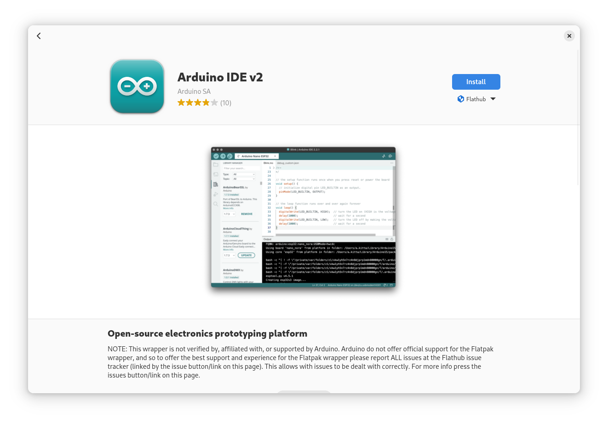
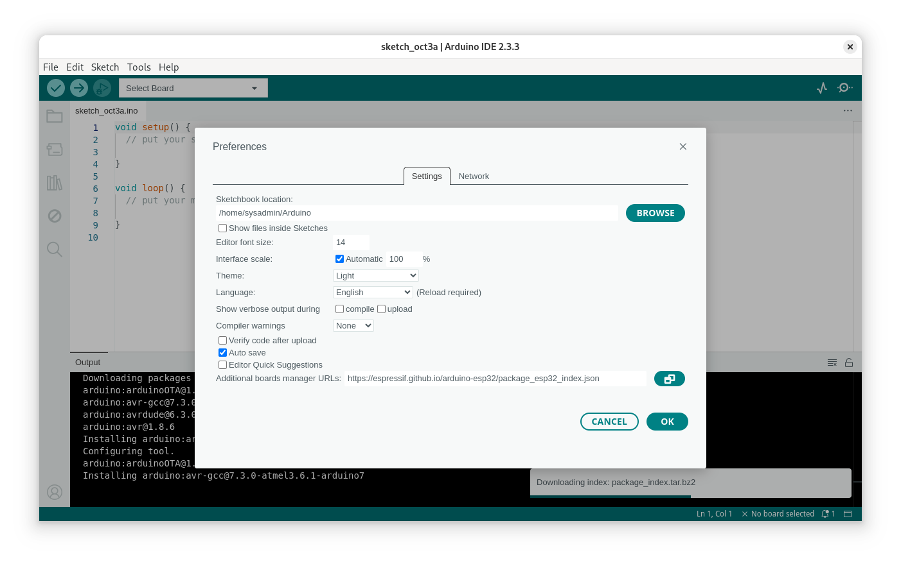

# Post Installation

## Gnome tweak

```
sudo dnf install gnome-tweaks
```

## Install VS code Editor

``` bash linenums="1"
sudo rpm --import https://packages.microsoft.com/keys/microsoft.asc
echo -e "[code]\nname=Visual Studio Code\nbaseurl=https://packages.microsoft.com/yumrepos/vscode\nenabled=1\ngpgcheck=1\ngpgkey=https://packages.microsoft.com/keys/microsoft.asc" | sudo tee /etc/yum.repos.d/vscode.repo > /dev/null
```

```
dnf check-update
sudo dnf install code
```

## Install NERD Fonts
Download or install the Nerd Fonts with the Nerd Fonts Installer script. To install Nerd Fonts, run the following script.

```
bash -c  "$(curl -fsSL https://raw.githubusercontent.com/officialrajdeepsingh/nerd-fonts-installer/main/install.sh)"
```

## Install python3

```
sudo dnf install python3 pyhon3-pip python3-devel
```

## Install NodeJs
```
sudo dnf install nodejs
```

## Install Arduino IDE2



[https://flathub.org/apps/cc.arduino.IDE2](https://flathub.org/apps/cc.arduino.IDE2)

```
sudo pip3 install pyserial
sudo usermod -aG dialout sysadmin
```

## Arduino Esp32 Git core

[https://docs.espressif.com/projects/arduino-esp32/en/latest/installing.html](https://docs.espressif.com/projects/arduino-esp32/en/latest/installing.html)

```
https://espressif.github.io/arduino-esp32/package_esp32_index.json
```
- copy link to arduino ide preference



## KVM and Vagrant

```
egrep -c '(vmx|svm)' /proc/cpuinfo
sudo dnf install @virtualization

sudo dnf install qemu-kvm libvirt libvirt-client virt-top virt-install virt-manager virt-viewer libguestfs-tools

sudo dnf install libvirt libvirt-daemon-kvm qemu-kvm virt-manager guestfs-browser libguestfs-tools python-libguestfs virt-top virt-install bridge-utils virt-viewer
```

```
sudo systemctl start libvirtd
sudo systemctl enable libvirtd 
sudo usermod -aG libvirt sysadmin

sudo virsh list --all 
```

Open the file /etc/libvirt/libvirtd.conf

```
sudo vim /etc/libvirt/libvirtd.conf

Set the UNIX domain socket group ownership to libvirt, (around line 85)

unix_sock_group = “libvirt”

Set the UNIX socket permissions for the R/W socket (around line 108)

unix_sock_rw_perms = “0770”

Restart libvirt daemon after making the change.

sudo systemctl restart libvirtd.service
```

```
sudo dnf install vagrant
vagrant plugin install vagrant-libvirt
vagrant box add generic/centos9s
```

**Error:**
The rpm for Fedora defaults the connection to libvirt to use the session connection qemu:///session which does not support creating networks, though you can use networks that have been already created.

```
Network 192.168.33.10 is not available. Specify available network
name, or an ip address if you want to create a new network.


Vagrant.configure("2") do |config|
  config.vm.provider :libvirt do |libvirt|
    libvirt.qemu_use_session = false
    # if the above doesn't work, try uncommenting the following instead
    #libvirt.uri = 'qemu:///system'
  end
end


```


## Install Thai Language Fonts

```
sudo dnf install tlwg-*
sudo dnf install  google-noto-sans-thai-fonts ibm-plex-sans-thai-fonts thai-arundina-sans-fonts  thai-arundina-sans-mono-fonts thai-arundina-serif-fonts
```

[https://github.com/opendevbook/thai-font-collection](https://github.com/opendevbook/thai-font-collection)

install windows fonts
```
sudo dnf install curl cabextract xorg-x11-font-utils fontconfig -y
sudo rpm -i https://downloads.sourceforge.net/project/mscorefonts2/rpms/msttcore-fonts-installer-2.6-1.noarch.rpm
```

## starship
[https://starship.rs/](https://starship.rs/)

```
curl -sS https://starship.rs/install.sh | sh 
```

## Install Multi Media

```
sudo dnf install vlc

sudo dnf install gstreamer1-plugins-{bad-\*,good-\*,base} gstreamer1-plugin-openh264 gstreamer1-libav --exclude=gstreamer1-plugins-bad-free-devel

sudo dnf install lame\* --exclude=lame-devel

```

## Install Chromne

```
sudo dnf install fedora-workstation-repositories
sudo dnf install google-chrome-stable
```

## Escalidraw
```
docker run -p 8080:80 -d docker.io/excalidraw/excalidraw:latest
```
Now that Excalidraw is running as a Docker container, you can access it through a web browser by navigating to http://yourp:8080.
```
http://yourip:8080
```